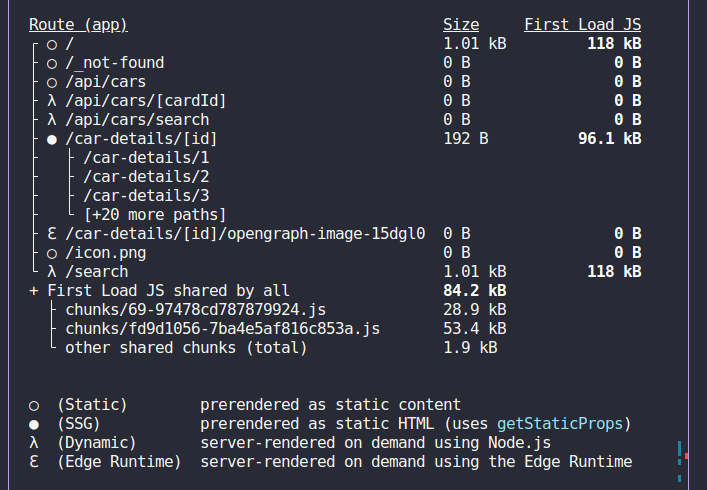

### Descrição

This project was a next.js hands-on testing for senior develop a mini-application in Next.js for a car stand.

#### Todo

- [x] Car Search: A search field to filter cars by make or model.
- [x] Implement a search field that filters the list of cars on the client side.
- [x] Use SSR to render the car listing.
- [x] Implement dynamic routing for each car detail page.
- [x] Use getStaticPaths and getStaticProps to pre-render the detail pages.
- [ ] writing tests using Jest and React Testing Library.

### Obs:

To generate the static pages of the car details, it is necessary that at the time of the build the project is running, since the **backend** in the api in Next.js was created only to generate a fake api.

### How to lower the project in your machine:

```bash
  # Clone project
  git clone https://github.com/mauriciogirardi/nextjs-challenge.git

  # Go nextjs-challenge folder
  cd nextjs-challenge

  # Install dependence's
  npm i

  # Create a file .env.local and add this envs
  NEXT_PUBLIC_API_BASE_URL="http://localhost:3000/api"
  APP_URL="http://localhost:3000"

  # Run project
  npm run dev
```

### Build


